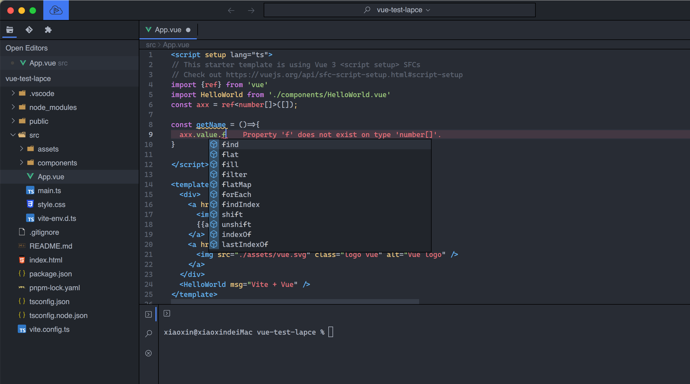

# Lapce Plugin for Vue (based volar)

### Preview

### Usage

> Required: Lapce version must be greater than 2.0, and you can use Lapce nightly version. [click here to get the newest version](https://github.com/lapce/lapce/releases)

****

**Installation through the plugin market**

Open Lapce (version > 2.0 required) and click the plugin icon, then find the 'vue' plugin, and click install.

**Manual installation** 

1. Open Lapce， Press the F1 key on your keyboard, then input `:open plugins Directory` in the command palette.
2. Download `lapce-vue.tar.gz` [click here to get release](https://github.com/xiaoxin-sky/lapce-vue/releases)
3. Extract lapce-vua.tar.gz into your lapce plugins directory.
4. Reload Lapce
